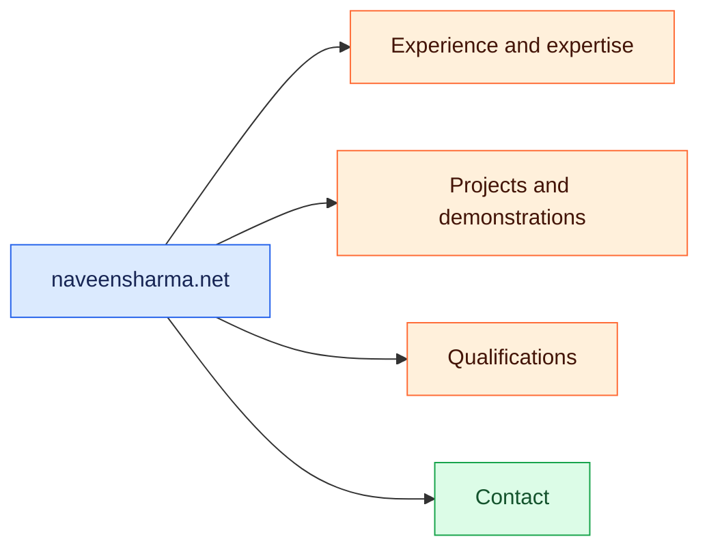

# Naveen Sharma — Professional Portfolio

<div align="center">


[🌐 Naveen Sharma](https://naveensharma.net) · [💼 LinkedIn](https://www.linkedin.com/in/naveensharmatech/)

</div>

[Verified professional focus](#section-1) · [Selected public work](#section-2) · [Local development](#section-3)

### 🗺️ Visual overview

A visual guide to the project and the documentation below.



---


Employer-focused portfolio for Naveen Sharma, centered on SaaS implementation, workflow configuration, QA/UAT, and practical automation.

<a id="section-1"></a>

## Verified professional focus

- Healthcare SaaS implementation and technical support
- Dynamic forms, workflow configuration, data mapping, and user acceptance testing
- Earlier experience in manufacturing QA and operations/training support
- Practical automation and public projects linked below

<a id="section-2"></a>

## Selected public work

- [Customer Inquiry Router](https://github.com/naveensharmatech/customer-inquiry-router-zapier)
- [B2B Lead Generator on Apify](https://apify.com/opility/b2b-leads-scraper-1-5-1k-leads-emails-phones)
- [Shopify Store Lead Extractor on Apify](https://apify.com/opility/shopify-store-lead-extractor-emails-catalog-size-apps)

The private `work-and-projects` repository contains supporting records. Client and employment materials are not published from this site.

<a id="section-3"></a>

## Local development

```bash
npm ci
npm run dev
```

Build with `npm run build`.

## Mobile accessibility and deployment

See the [mobile optimization checklist](MOBILE_OPTIMIZATION.md) for responsive
layouts, system dark mode, touch targets, keyboard navigation, and validation.
Follow the [Cloudflare deployment guide](docs/DEPLOYMENT.md) to preview and release
the reviewed changes from `main`.
